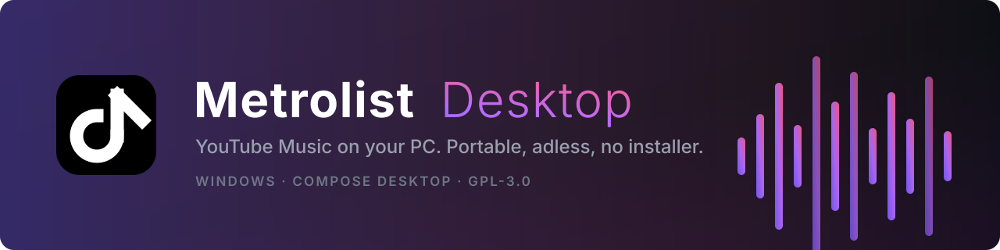

<div align="center">



<br>

[](https://github.com/Doctordefector/Metrolist-Desktop/releases/latest)
[](https://github.com/Doctordefector/Metrolist-Desktop/releases/latest)
[](LICENSE)
[](https://github.com/Doctordefector/Metrolist-Desktop/releases/latest)

**The original desktop port of [Metrolist](https://github.com/MetrolistGroup/Metrolist).**
A full YouTube Music client for Windows: your real library, your real playlists, no ads, no
installer, no telemetry. Unzip it and it runs.

[**Download**](https://github.com/Doctordefector/Metrolist-Desktop/releases/latest) ·
[Features](#features) · [Troubleshooting](#troubleshooting) · [Build from source](#build-from-source)

</div>

---

## Install

1. Grab `Metrolist-X.Y.Z-portable.zip` from [the latest release](https://github.com/Doctordefector/Metrolist-Desktop/releases/latest).
2. Extract it **anywhere except a cloud-synced folder** (see the warning below).
3. Run `Metrolist.exe` and sign in with your browser.

There is nothing else to install. VLC and ffmpeg ship inside the archive, and the app carries its
own Java runtime. Windows 10 or 11, 64-bit.

> [!WARNING]
> **Do not extract into OneDrive, Dropbox, or a synced Desktop/Documents folder.** Metrolist is
> portable by design: the database, your login, and your downloads all live next to
> `Metrolist.exe`. A sync client that reopens those files mid-write will corrupt the database or
> lock it on startup. `C:\Metrolist` is a good home; the Desktop usually is not.

## Features

| | |
|---|---|
| **Playback** | Streaming and local files through a bundled VLC engine, gapless queue, shuffle and repeat, crossfade, playback speed 0.25×–3×, sleep timer, 10-band equalizer with presets, skip silence, volume normalization |
| **Library** | Full two-way sync with YouTube Music: liked songs, albums, artists and playlists, and every edit you make locally is pushed back to your account. Local playlists, auto playlists, sorting, search and grid/list views |
| **Discovery** | Home feed with continuations, Explore (new releases, moods & genres, charts), search with filters and suggestions, radio and auto-queue, quick picks, podcasts |
| **Lyrics** | Synced and plain, from a five-provider chain (BetterLyrics → LrcLib → KuGou → YouTube lyrics → YouTube transcript), with size, alignment and click-to-seek options |
| **Social** | Listen Together rooms with live playback sync, Discord Rich Presence, Last.fm scrobbling |
| **Extras** | Music recognition through Shazam, listening stats and history, downloads with progress, car/USB export to loudness-normalized MP3, backup and restore, proxy support, region and language settings, system tray with a mini player, media-key and keyboard shortcuts, Material 3 theming that follows your system |

Everything the app writes (database, credentials, preferences, cache, downloads) stays in the
app's own folder. Nothing is written to `%APPDATA%`, and nothing is sent anywhere but YouTube.

## Why this port

Metrolist Desktop is not a wrapper around the website and not a repackaged APK. It is a native
Compose Desktop (JVM) application that talks to the same InnerTube API the Android app uses, with
its own player, database and sync layer written for the desktop.

- First release **9 March 2026**, the first desktop port of Metrolist, and still the one that
  gets the updates: 50 releases since.
- Auto-updater built in: it checks GitHub, downloads the new portable ZIP and restarts itself.
- Shared API modules are kept in sync with upstream Metrolist (currently v13.6.0).

Forks are welcome; it is GPL-3.0 and that is the point. This repository is where the work happens.

## Troubleshooting

**The window never appears.** Metrolist writes `metrolist.log` next to `Metrolist.exe` on every
launch, and a failure to start now reports itself in a dialog *(v2.9.2 and newer)*. Send that log
with a [bug report](https://github.com/Doctordefector/Metrolist-Desktop/issues). The most common
cause is a cloud-synced install folder, so move it out of OneDrive and try again.

**"VLC not found".** The bundled copy lives in `app/resources/vlc`. If your unzip tool skipped it
(some do, on long paths), extract again with 7-Zip or Windows Explorer, or install VLC 3.x 64-bit
and Metrolist will use that instead.

**Car / USB export does nothing.** That feature shells out to `app/resources/ffmpeg/ffmpeg.exe`.
If your antivirus quarantined it, restore it or drop any `ffmpeg.exe` next to `Metrolist.exe`.

**Everything looks empty after signing in.** An expired YouTube session returns empty results
rather than an error. Sign out and sign in again from Settings.

## Build from source

```bash
git clone https://github.com/Doctordefector/Metrolist-Desktop.git
cd Metrolist-Desktop
./gradlew :desktop:createDistributable
```

Needs JDK 21. The build downloads ffmpeg once (~114 MB) into `desktop/resources/windows-x64/`;
VLC is already in the tree. The runnable app lands in
`desktop/build/compose/binaries/main/app/Metrolist/`, and `./gradlew :desktop:packagePortableZip`
produces the release archive.

`./gradlew :desktop:run` starts it straight from the source tree.

## Credits

- [Metrolist](https://github.com/MetrolistGroup/Metrolist) by mostafaalagamy and the Metrolist
  Group: the Android app this port descends from, and the source of the shared InnerTube,
  LrcLib, KuGou, BetterLyrics and ShazamKit modules.
- [vlcj](https://github.com/caprica/vlcj), [Compose Multiplatform](https://github.com/JetBrains/compose-multiplatform),
  [SQLDelight](https://github.com/cashapp/sqldelight), [NewPipe Extractor](https://github.com/TeamNewPipe/NewPipeExtractor).

## License

GPL-3.0. See [LICENSE](LICENSE). Metrolist is not affiliated with YouTube, Google, or Alphabet.
